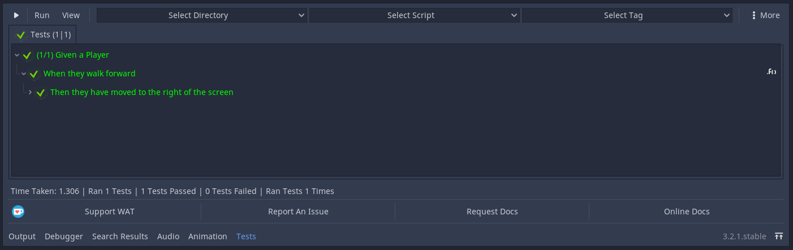

Introduction
=============

*************
What is WAT?
*************

WAT is an automated testing plugin for [Godot].

**********************
What You Need To Know
**********************

Automated Testing is an advanced topic in programming. This documentation assumes you have a basic working knowledge
of both programming fundamentals and at the very least a passing understanding of the Godot Engine API.

***************************
What is Automated Testing?
***************************

Have you ever been unsure if a returned value was correct or if the method returning that value was even being called in the first place and in your
frustration you've added a print statement to make sure? If you're reading this I don't doubt that you have! Everybody tests!

::

    class_name Player

    var coin: int
    var inventory: Inventory

    func buy(item: Item) -> void:
        print("player is buying " + item)
        if coin => item.cost:
            coin -= item.cost
            inventory.add(item)

This is a example of manual Unit Test. A Unit Test tests a unit of code, in this case our unit is the
buy method of the Player object.

There are three main problems with manual testing like this:

1. Slow - You must run the test manually and set it into the correct state to test this. This can get very tedious depending on what you're testing
and how many times you are testing it. 
  
2. Cluttered - Your code becomes cluttered with print statements and it is hard to seperate what is your game from what is your tests.

3. Refactoring is a risk - Game Development is full of interacting systems which means refactoring one part of your code might break
another part of your code you weren't expecting to be affected. This can spiral out of control into a negative feedback loop where you're
too scared to refactor your tests so you don't which makes your code even messier and even scarier to refactor. You can't even be sure what you broke
assuming you were thorough with your print statements because there is too many output logs to spot the one missing (this is another case of point two).

Automated Testing solves these problems (and more) because

1. Fast - Automated Tests by the nature of being automated tests are fast (or at the very least faster than you at testing). After the first time you have created
your test, all you need to do is to click a button to run it. 

2. Isolated - Automated Tests are methods that are used in a special script known as a "Test Suite" which keeps your tests isolated from your code. 

3. Clarity - Due to the way the Tests are displayed in WAT, when you change code somewhere and it breaks code elsewhere. If you had a test for that now
broken code, you should be able to navigate directly toward it through the clear use 

3. Clarity - When you change your code and code breaks somewhere else WAT uses a red cross and a white name to show a failed test.

[ShowPassingAndFailedTestsInGUI]

***************
Your First Test
***************

We are going to test that our players can walk forward correctly.

::

    extends Sprite
    class_name Player

    const SPEED: int = 400

    func _process(delta: float) -> void:
        if Input.is_key_pressed(KEY_D):
            walk_forward(delta)
        elif Input.is_key_pressed(KEY_A):
            walk_backward(delta)
	
    func walk_forward(delta: float = 0.1) -> void:
        _walk(delta, 1)
        
    func walk_backward(delta: float = 0.1) -> void:
        _walk(delta, -1)

    func _walk(delta: float, direction: int) -> void:
        position.x += direction * SPEED * delta

Create a folder called tests in your Project's main folder then create a script named ``player.test.gd`` that extends ``WAT.Test``
and store it in that folder. This script is an example of a Test Suite aforementiond in the introduction.

A Test Suite is a collection of Tests where each test is a unique function. In WAT these functions are prefixed with the term test. This prefix
is necessary for WAT to seperate the functions that are tests from the functions that are not.

::

    extends WAT.Test

    func test_when_they_walk_forward() -> void:

Let's step back for a moment before we write the test itself and just remind ourselves of what we're testing. In this case we want to make sure our instance of
the ``Player`` class can ``walk_forward`` but what are we looking for in our results? Well let's check the code again:

::

    func walk_forward(delta: float = 0.1) -> void:
        _walk(delta, 1)

    func walk_backward(delta: float = 0.1) -> void:
        _walk(delta, -1)

    func _walk(delta: float, direction: int) -> void:
        position.x += direction * SPEED * delta

In this case we're passing in a positive or negative position depending if we're walking forward or backward. Therefore if we're walking forward we're checking to see
if our x position has increased.

With our goal in mind, let's write our test!

::

    extends WAT.Test

    func test_when_a_player_walks_forward_they_moved_to_the_right() -> void:

        var player = Player.new()
        player.walk_forward()
        asserts.is_true(0 < player.position.x)

(Our player's default position is Vector2(0, 0) so any x value greater than 0 is a success)

Open up WAT by clicking on the "Tests" Button near the bottom middle of Godot. This will open the
WAT GUI where in the top left you can see a play button. Click that to run all tests. If all went well you should
have seen a screen like this.

[RESULTSCREEN]

***********
Assertions
***********

Asserts vs Manual Test Methods (display, inner-workings)

*******************
Arrange-Act-Assert
*******************

****************
A Detailed View
****************

option describe and context messages, conventions like given-when-then

We seperate our test body into three distinct parts; Arrange, Act & Assert.

In the Arrange step we create an instance of our Player class and get its current position. This is our set of preconditions, we need a player
instance so we can move it and we need its current position so we can compare against our future position.

In the Act step we tell our player instance to walk_forward. This is the event or action that we're testing. We're testing to see if the walk_forward code
works as we expect it to do.

In the Assert step we get our new x position and check if it is greater than the older x position. This is our tests postcondition, what we need to
be true after the code has been executed for our test to pass. 

Click the Play button in WAT (near the top right of the bottom panel) and you should see this screen after a second.

In the Assert step of our test body you will have noticed that we didn't use a simple ``print(previous_x_position < new_x_position)`` check like you may do in
a naive manual test, instead we called the ``is_true`` method of our ``asserts`` property. This is where Automated Testing starts proving its usefulness over
manual testing.

The asserts property is a list of functions that wrap common conditional checks. In addition to performing the check, these functions also allow us to add
a clear diagnostic message (the String we used in our test) which is then shown in our results tree with a green font and a checkmark if correct or 
a red cross and default white font if not. 

In the [introduction] we explained the conundrum manual testing presents to you by forcing you to choose either to have your code cluttered with 
print debug statements OR removing the tests after you've finished checking them only to have that code break down once again later when you no 
longer remember how you fixed it in the first place.

Automated Testing solves this by shifting all of these print debug statements to these Assertions and displaying them this in WAT's Result Tree.
Your production code is no longer cluttered with numerous print debug statements but you still have your tests! 
So if you do encounter a bug, any of your tests that fail may give you a greater idea about what happened. 
This is especially potent if you run your tests often and catch bugs early so you know the reason the code broke is something you just did!

In our test we used the basic ``is_true`` function but we could have also done either of these (among many others you can see at [assertions].

::

    asserts.is_greater_than(new_x_position, old_x_position, \
                             "Then they have moved to the right of the screen")

    asserts.is_less_than(old_x_position, new_x_position, \
                          "Then they have moved to the right of the screen")