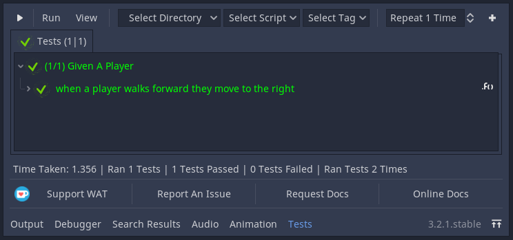
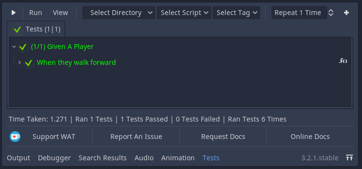
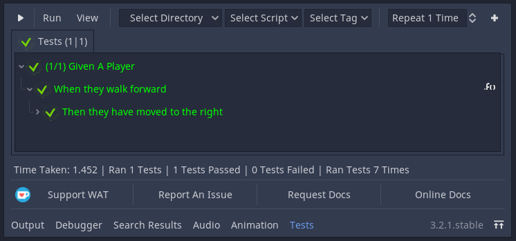
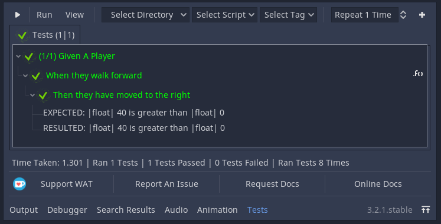

Introduction
=============

*************
What is WAT?
*************

WAT is an automated testing plugin for [Godot].

**********************
What You Need To Know
**********************

Automated Testing is an advanced topic in programming. This documentation assumes you have a basic working knowledge
of both programming fundamentals and at the very least a passing understanding of the Godot Engine API.

***************************
What is Automated Testing?
***************************

Have you ever been unsure if a returned value was correct or if the method returning that value was even being called in the first place and in your
frustration you've added a print statement to make sure? If you're reading this I don't doubt that you have! Everybody tests!

::

    class_name Player

    var coin: int
    var inventory: Inventory

    func buy(item: Item) -> void:
        print("player is buying " + item)
        if coin => item.cost:
            coin -= item.cost
            inventory.add(item)

This is a example of manual Unit Test. A Unit Test tests a unit of code, in this case our unit is the
buy method of the Player object.

There are three main problems with manual testing like this;

* **Slow**

    You must run the test manually and set it into the correct state to test this. This can get very tedious depending on 
    what you're testing and how many times you are testing it.

* **Cluttered**

    Your code becomes cluttered with print statements and it is hard to seperate what is your game from what is your tests.

* **Refactoring is risky**

    Game Development is full of interacting systems which means refactoring one part of your code might break
    another part of your code you weren't expecting to be affected. This can spiral out of control into a negative feedback loop where you're
    too scared to refactor your tests so you don't which makes your code even messier and even scarier to refactor. You can't even be sure what you broke
    assuming you were thorough with your print statements because there is too many output logs to spot the one missing (this is another case of point two).

Automated Testing solves these problems (and more) because;

* **Fast**

    Automated Tests by the nature of being automated tests are fast (or at the very least faster than you at testing). After the first time you have created
    your test, all you need to do is to click a button to run it. 

* **Isolated**

    Automated Tests are methods that are used in a special script known as a "Test Suite" which keeps your tests isolated from your code. 

* **Clarity**

    When you change your code and code breaks somewhere else WAT uses a red cross and a white name to show a failed test (as shown below) so it is easy
    to locate what is broken without pouring through a waterfall of print outputs.

    [ShowPassingAndFailedTestsInGUI]

***************
Your First Test
***************

We are going to test that our players can walk forward correctly.

::

    extends Sprite
    class_name Player

    const SPEED: int = 400

    func _process(delta: float) -> void:
        if Input.is_key_pressed(KEY_D):
            walk_forward(delta)
        elif Input.is_key_pressed(KEY_A):
            walk_backward(delta)
	
    func walk_forward(delta: float = 0.1) -> void:
        _walk(delta, 1)
        
    func walk_backward(delta: float = 0.1) -> void:
        _walk(delta, -1)

    func _walk(delta: float, direction: int) -> void:
        position.x += direction * SPEED * delta

Create a folder called tests in your Project's main folder then create a script named ``player.test.gd`` that extends ``WAT.Test``
and store it in that folder. This script is an example of a Test Suite aforementiond in the introduction.

A Test Suite is a collection of Tests where each test is a unique function. In WAT these functions are prefixed with the term test. This prefix
is necessary for WAT to seperate the functions that are tests from the functions that are not.

::

    extends WAT.Test

    func test_when_they_walk_forward() -> void:

Let's step back for a moment before we write the test itself and just remind ourselves of what we're testing. In this case we want to make sure our instance of
the ``Player`` class can ``walk_forward`` but what are we looking for in our results? Well let's check the code again:

::

    func walk_forward(delta: float = 0.1) -> void:
        _walk(delta, 1)

    func walk_backward(delta: float = 0.1) -> void:
        _walk(delta, -1)

    func _walk(delta: float, direction: int) -> void:
        position.x += direction * SPEED * delta

In this case we're passing in a positive or negative position depending if we're walking forward or backward. Therefore if we're walking forward we're checking to see
if our x position has increased.

With our goal in mind, let's write our test!

::

    extends WAT.Test

    func test_when_a_player_walks_forward_they_move_to_the_right() -> void:

        var player = Player.new()
        var previous_position = player.position.x
        player.walk_forward()
        asserts.is_true(previous_position < player.position.x)

Open up WAT by clicking on the "Tests" Button near the bottom middle of Godot. This will open the
WAT GUI where in the top left you can see a play button. Click that to run all tests. If all went well you should
have seen a screen like this.

.. image:: imgs/results.png

***********
Assertions
***********

WAT uses special methods from the assert property (known as assertions) instead of a print statement. This allows WAT to track which
tests did or didn't pass and allows that information to be passed onto the display. In our case we used the asserts.is_true  

WAT uses custom objects known as assertions which are created by using methods from the assert property. These are used instead of print statements so
WAT can track which tests passed/failed and how to display that information depending on wheter you're using the GUI or the Command Line.

In our test above we used the asserts.is_true method which checks if a boolean expression is true, however there are a number of other assertion methods you
can use instead for better clarity. In this case we could have replaced this assertion method with ``asserts.is_greater_than(player.position.x, previous_position)``
which checks if the first argument is greater than the second argument.

*********************
Test Fixture Methods
*********************

Sometimes when you have multiple tests in the same script testing the same object, you may want to extract out the shared logic. WAT allows you to do this
with special test hook methods.  

You can use start() to set the state of the test before you run any test and use end() to clear any data after you have run every test. In the example
below we create a player to run tests on and then free it afterward we've run every test.

::

    extends WAT.Test

    var player: Player

    func start():
        player = Player.new()

    func end():
        player.free()

    func test_when_a_player_walks_forward_they_move_to_the_right() -> void:

        var previous_position = player.position.x
        player.walk_forward()
        asserts.is_greater_than(player.position.x, previous_position)

    func test_when_a_player_walks_backward_they_move_to_the_left() -> void:

        var previous_position = player.position.x
        player.walk_backward()
        asserts.is_less_than(player.position.x, previous_position)

There is still some shared logic in this test of getting the player's previous_position, we could then instead use pre() and post(). The pre() hook runs code
before each test method (so if we have two tests pre() is ran twice) and post() is ran after every test to clean up. 

In this example we create a player and grabs its position before every test and then free the player after every test.

::

    extends WAT.Test

    var player: Player
    var previous_position: int

    func pre():
        player = Player.new()
        var previous_position = player.position.x

    func post():
        player.free()

    func test_when_a_player_walks_forward_they_move_to_the_right() -> void:

        player.walk_forward()
        asserts.is_greater_than(player.position.x, previous_position)

    func test_when_a_player_walks_backward_they_move_to_the_left() -> void:

        player.walk_backward()
        asserts.is_less_than(player.position.x, previous_position)

Previously we mentioned getting into the correct state for a manual test can take a long time. These test-hooks allow you to setup that complicated state
and have it refresh per every test in the script which is one of the major benefits of automed testing. Not only that but by using hooks you can make the tests
themselves avoid clutter and focus on what's really important a per test basis.

***********************
A Detailed String View
***********************

So far when we have run our tests we have gotten an image like this.

.. image:: imgs/results.png

Which shows us the sanitized path of the Test Suite and the test method name. WAT comes with three helper methods to give these names
better clarity for those who want them.

Every Test Suite has a title() method that users are intended to override to return a String. This will replace the test script path with
(hopefully) a clearer name in the results display.

::

    extends WAT.Test

    func title() -> String:
        return "Given A Player"

Any time you run a test method, you can call the describe method which takes a String and will replace the test method name with that String in the
results display.

::

    extends WAT.Test

    func title() -> String:
        return "Given A Player"

    func test_when_a_player_walks_forward_they_move_to_the_right() -> void:
        describe("When a they walks forward")

And any assertion method you use has an optional context string as the very last argument which makes that assertion show up in the results display
with that context string.

::

    extends WAT.Test

    func title() -> String:
        return "Given A Player"

    func test_when_a_player_walks_forward_they_move_to_the_right() -> void:
        describe("When they walk forward")

        var player = Player.new()
        var previous_position = player.position.x
        player.walk_forward()
        asserts.is_greater_than(player.position.x, previous_position, "Then they have moved to the right")

You can also check the basic details of that assertion by clicking on it (if you didn't include the context string for that
assertion, you can find the details by clicking on the method name).

    