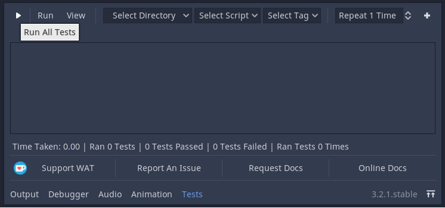
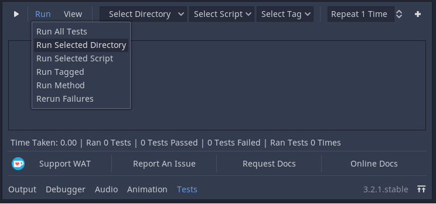
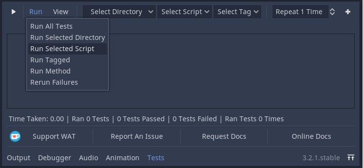
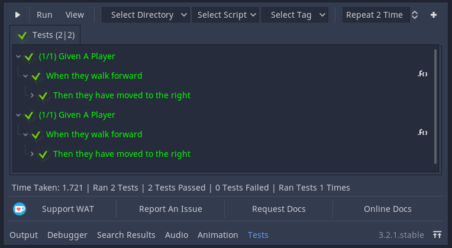
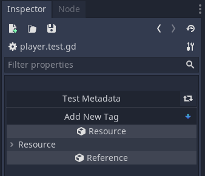
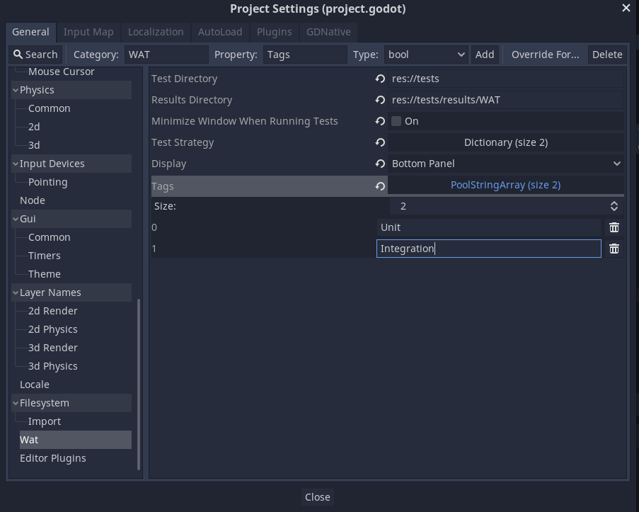
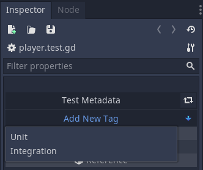
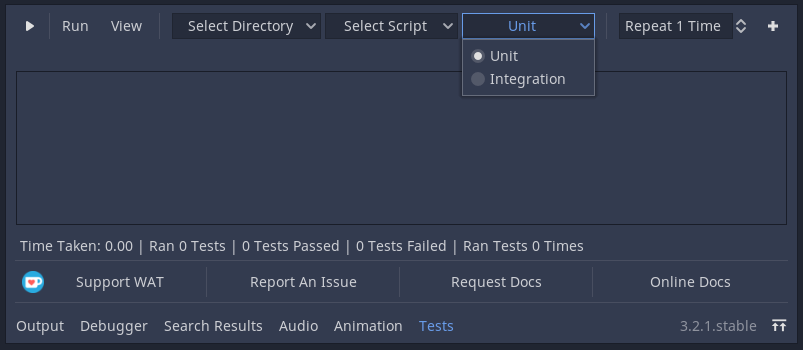
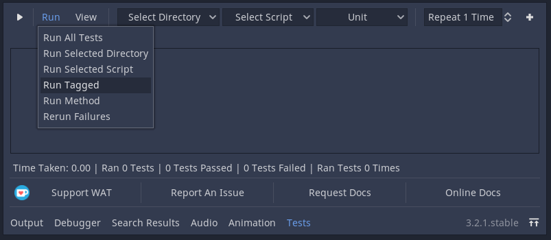
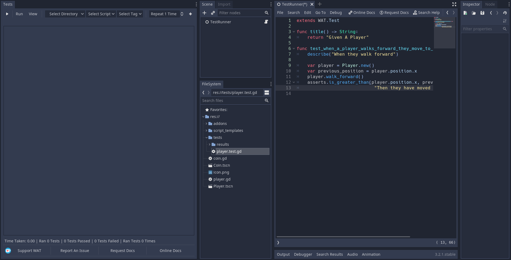

Using The GUI
==============

Click "Tests" on the middle bottom of Godot to open WAT's GUI.

.. image:: imgs/open_tests.png

******************
Running All Tests
******************

Click the play button in the top left of the WAT GUI to run all of your tests in your
test directory (this will also run tests in subdirectories of the test directory).

(You can also click "Run All" on the Run Menu that is beside the play button)

***********************
Running A Subdirectory
***********************

You can group your different tests by directory (e.g You can seperate your tests by putting them in fast or slow
subdirectories). To select a subdirectory to run, you can choose it from the drop down menu closest to the left of
the screen and then press "Run Selected Directory" from the Run Menu.

.. image:: imgs/select_subdir.png 

****************************
Running A Single Test Suite
****************************

You can run single tests by choosing a single test script from the middle drop down menu and then press "Run Selected Script"

.. image:: imgs/select_script.png

*****************************
Running A Single Test Method
*****************************

To run a single test method within a script you first need to select the script. Then press the + button to the top right of the GUI
which will reveal another drop down menu. Choose the test method you want to run from this and then click "Run Method" from the Run Menu.

.. image:: imgs/open_method.png
.. image:: imgs/run_method.png

****************
Repeating Tests
****************

You can tell WAT to repeat running the test x times before displaying it. This will display the test that amount of times you have run it. This
can help you identify a problem when dealing with erratic tests that sometimes fail and sometimes don't.

To repeat these tests, enter the amount of times you want the test to repeat in the SpinBox near the top right of the GUI.

****************************
Running Failed Test Methods
****************************

If you ran a number of tests with only some failing, you can choose to 

To rerun tests that have failed, you can press the "Rerun Failures" from the Run Menu which will only run the tests that have failed. 

.. image:: imgs/rerun_failures.png

WAT keeps track of failures, so if you have left your project one day to come back to it another. You can choose rerun failures and it
should rerun the failed tests since your last run.

***********************
Running Tagged Scripts
***********************

When you click on a saved test script, you should see it open up in an inspector plugin where you see something like this:

When you click on "Add New Tag" the first time, nothing will show. You will need to manually add tags to your
tag list in ProjectSettings -> WAT -> Tags.

Afterwards you can click on Add New Tag and then a list of all the available tags will show up. 

.. image:: imgs/unit_tag_selected.png

To run a group of tests with a shared tag, you can choose which tag by selecting it from the right-most drop down menu (if
any are available) and then press "Run Tagged" from the Run Menu.

********************
Inspecting The Test
********************

When you run a test, you will see the script name along with all of the test methods with sanitized names. Additionally if you
choose to use the optional context string argument (that is present in every assertion method as the last argument), then you will
also see that string popup. By opening the assertion message you will see the basic details of the assertion (if you didn't include
a context string for this assertion then it will appear under the method name instead).

You can find the view menu beside the run menu. This will allow you to expand all information or collapse all information. You can
also expand all information from only the failed tests.

.. image:: imgs/view_menu.png

If the information presented here isn't enough or if you want to double check, you can click on the function icon at the right end
of a method name in the results view and WAT will do its best to take you directly to that method in the script editor (give or take
a few lines)

.. image:: imgs/goto_method.png

************************
Repositioning The Panel
************************

You can move the WAT GUI anywhere by going to ProjectSettings -> WAT and selecting a position from the Display drop down.

.. image:: imgs/reposition.png

And then it will change its position automatically

