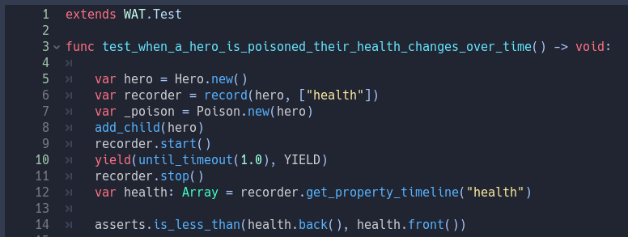
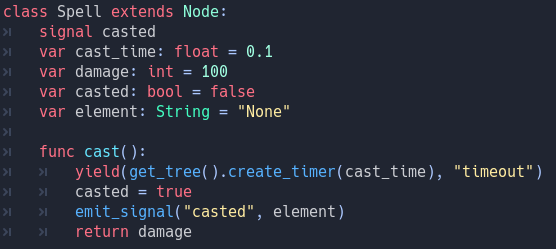
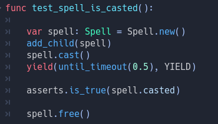
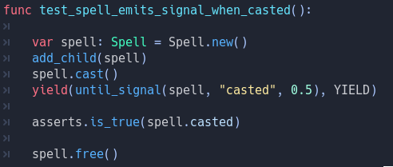
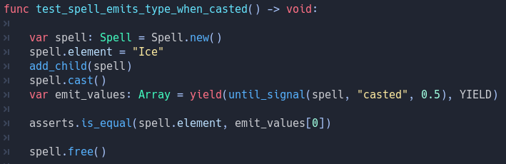

Utility Methods
================

WAT includes a number of Utility Methods in its base Test Suite to help users handle common difficulties in testing.

**********************
Parameterized Testing
**********************

You may find yourself repeating whole tests with the same structure where the only difference is the input data. You can solve this
by using the builtin parameters() method within a single test method which takes an array of arrays.

.. image:: imgs/calc_test.png

The first nested array takes a collection of strings. These strings will be used as keys in our internal p (for parameters) object. The arrays
after the first contain the values we are going to use each time we run the test. So in our first test we will use 2, 2, 4 where p.addend is 2,
p.augend is 2 and p.result is 4. In our second test p.addend is 5, p.augend is 3, p.result is 8 and so on and so forth. This test will be repeated
equal to the number of arrays (minus one for the first) inside the outer array.

.. image:: imgs/calc_test_repeated.png

*********************
Recording Properties
*********************

Sometimes values change during the course of the game; You're hero may be taking poison damage that changes their health over time.

If you want to track a time sensitive change, you can use the record method.

.. image:: imgs/hero.png

The record method takes an object and an array of strings. These strings must be the name of a property on the object you passed in. It will
return a Recorder Object that you can start and stop. Below we are recording the hero's health after being poisoned for a second.

You can retrieve an Array of values by using the recorder.get_property_timeline(property: String) method where property is one of the Strings you passed
in on the record method. In this case we're getting the range of different health values our hero has had and then checking that their current health value
is lower than our previous health value.

You can track multiple properties of one object from one Recorder Object but you cannot track multiple Objects from one Recorder. You will need to create
a Recorder per object that you are tracking.

*********
Simulate
*********

Sometimes you may want to track if a change is happening over time but you may not actually care to wait for that amount of time. WAT uses the
simulate method to call _process and _physics_process on Node Object and all of its descendants in quick cycles. 

.. image:: imgs/hero.png
.. image:: imgs/simulate.png

In this example we're calling simulate on a poisoned Hero node (who has the poison node as a child). We're repeating their _process method 100 times
along with a delta value of 0.1 in order to check our Hero does indeed have no health after 100 cycles.

*****************
Watching Signals
*****************

You can use the watch method to track what objects emit which signals:

.. image:: imgs/watching.png

You pass in the object you want to watch and which signal you want to track. You can use [signal assertion links goes here] to track
more specific properties of the emitted signals (such as what parameters were passed in).

******************
Yielding In Tests
******************

You may want to use yield when dealing with time sensitive methods such as a cast time for a spell 

This may cause a problem where your test not only fails but also prevents other tests from running because that timer or signal never went off. 

WAT solves this problem by introducing with the methods until_timeout() and until_signal().

To pause a test call until_timeout(time: float) as the first argument of a yield statement. WAT will pause the test for that amount of time. The second
argument of the yield statement is the YIELD constant builtin of the Test Suite. This is used by WAT to unpause the test. 

To wait for a signal when testing call until_signal(time: float, emitter: Object, event: String). WAT will wait until either emitter emits the event Signal
or if time runs out (whichever comes first). This will prevent your tests from hanging if the signal is never emitted.

You can also inspect arguments emitted along with the signal.

Yielding until a signal will return an Array of up to 6 values that default to Null. These values will be any values that was emitted along side the
signal.
